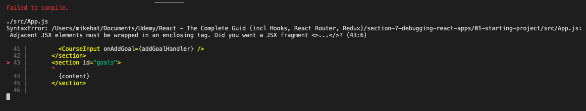

# React Debugging

## Syntax Error Example

### Error:



### Relevant code from App.js lines 40-46

```javascript
<section id="goal-form">
<CourseInput onAddGoal={addGoalHandler} />
</section>
<section id="goals">
{content}
</section>
```

### Solution: Wrap adjacent items in an enclosing tag

```javascript
<div>
    <section id="goal-form">
        <CourseInput onAddGoal={addGoalHandler} />
    </section>
    <section id="goals">{content}</section>
</div>
```

## Error 2:

### Clicking on a goal to delete it causes a different goal to be deleted

```javascript
const deleteItemHandler = (goalId) => {
    setCourseGoals((prevGoals) => {
        const updatedGoals = prevGoals.filter((goal) => goal.id !== goalId);
        return updatedGoals;
    });
};
```

### Solution:

    It looks like deleteItemHandler() is getting the wrong id.
    ids are created in the addGoalHandler():

```javascript
const addGoalHandler = (enteredText) => {
    setCourseGoals((prevGoals) => {
        const updatedGoals = [...prevGoals];
        updatedGoals.unshift({ text: enteredText, id: "goal1" });
        return updatedGoals;
    });
};
```

    id is assigned to a hard-coded string, "goal1".
    This means that all goals share the same id.
    ids need to be unique for the deleteItemHander() to work.

### Using Math.random() to create pseudo-unique id values:

```javascript
const addGoalHandler = (enteredText) => {
    setCourseGoals((prevGoals) => {
        const updatedGoals = [...prevGoals];
        updatedGoals.unshift({ text: enteredText, id: Math.random() });
        return updatedGoals;
    });
};
```

## _It helps to follow the flow of the code associated with behaivorial errors_

## Redoing the past error using breakpoints and the develepor tools

### In the Chrome dev tools:

    View your source code by going to:
    "Sources" tab => "Page" => "Users/..." dir or possibly in the "webpack" dir

### BREAKPOINT: click on the line number where you want to add it

    Open the CourseGoalItem.js file.
    Set a breakpoint on line 7:

` const deleteHandler = () => {`

    Click on the icon 'down arrow over a dot' to "step into" the function.
    As you step into and through the function, HOVER OVER VARIABLES TO SEE THERE VALUE

### EX: Hover over ```goalId``` in the paramaeter list to see it's value is ```"goal1"```


## REACT DEV TOOLS

### In the Components tab

Here it is clear the each goal has ```key ="goal1"```