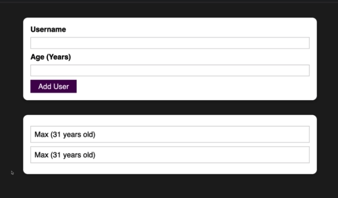
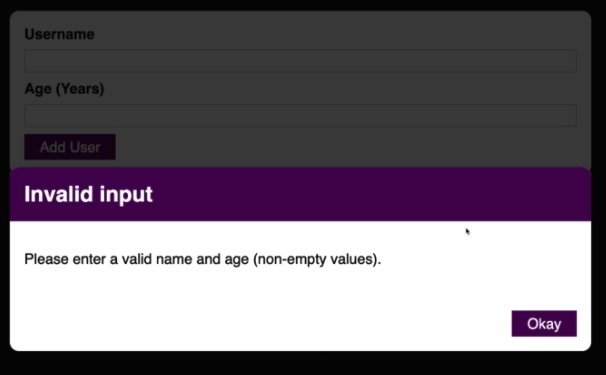

# [Time to Practice: A Complete Practice Project](https://www.udemy.com/course/react-the-complete-guide-incl-redux/learn/lecture/25598382#questions)

## The goal of the project is to create a user input form that displays the user's input onto the page.

## Invalid Input Warning Modals:

    If empty values are input, then the modal above pops up.

    If a negative number is input, then the above modal will pop up.